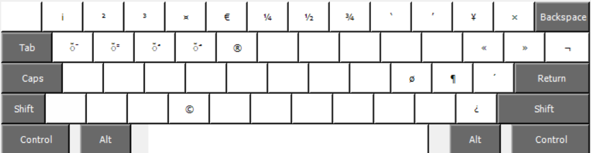

# Arabic QWERTY Keyboard Layout

A custom Arabic keyboard layout that maintains the familiar QWERTY key positions while providing Arabic character input. This layout is designed for users who are comfortable with QWERTY but need to type in Arabic.

## Features

- **QWERTY-based Layout**: Arabic characters mapped to familiar QWERTY positions
- **Multi-architecture Support**: Available for AMD64, i386, IA64, and WOW64 systems
- **Windows Compatible**: Native Windows keyboard layout installation
- **Easy Switching**: Standard Windows language switching (Alt+Shift or Windows+Space)

## Installation

### Automatic Installation (Recommended)

1. Download the appropriate installer for your system:
   - **64-bit Windows**: `Arabic_amd64.msi`
   - **32-bit Windows**: `Arabic_i386.msi` 
   - **IA64 Systems**: `Arabic_ia64.msi`
   - **Alternative**: `setup.exe` (auto-detects architecture)

2. Run the installer as Administrator
3. Follow the installation prompts
4. Restart your computer or log out and back in

### Manual Installation (Advanced Users)

For advanced users who prefer manual installation:

1. Navigate to the appropriate architecture folder (`amd64`, `i386`, `ia64`, or `wow64`)
2. Run the installation script: `install.sh` (Linux) or follow Windows manual installation procedures
3. Copy the layout files to your system's keyboard layout directory

## Usage

### Activating the Layout

1. **Windows 10/11**: 
   - Go to Settings > Time & Language > Language & Region
   - Add Arabic as a language
   - Select the custom Arabic QWERTY layout

2. **Windows 7/8**:
   - Control Panel > Clock, Language, and Region > Change keyboards or other input methods
   - Add the Arabic QWERTY layout

### Switching Between Layouts

- **Alt + Shift**: Quick switch between layouts
- **Windows + Space**: Cycle through all installed layouts
- **Language Bar**: Click to select layout (if enabled)

### Character Mapping

The layout follows QWERTY positioning logic with Arabic characters mapped to similar phonetic or positional equivalents. Common mappings include:

- Familiar letter positions maintain muscle memory
- Punctuation marks in expected locations
- Special Arabic characters accessible via standard key combinations

## Screenshots

### Character Mapping

### Shift

### Alt+Ctrl (AltGr)

### Ctrl


## System Requirements

### Windows
- Windows 7 or later
- Administrator privileges for installation
- 10 MB free disk space

### Linux
- XKB support
- Root access for system-wide installation
- Modern desktop environment (GNOME, KDE, XFCE, etc.)

## Troubleshooting

### Layout Not Appearing
- Ensure you have administrator privileges during installation
- Restart your computer after installation
- Check Windows Language settings to verify the layout was added

### Characters Not Displaying Correctly
- Verify your system has Arabic font support installed
- Check that your application supports RTL (right-to-left) text
- Ensure Unicode support is enabled in your text editor

### Installation Fails
- Run installer as Administrator
- Temporarily disable antivirus software during installation
- Check system requirements and architecture compatibility

## Uninstallation

### Windows
1. Go to "Add or Remove Programs" in Windows Settings
2. Find "Arabic QWERTY Keyboard Layout"
3. Click "Uninstall" and follow prompts

### Linux
Remove the layout file from your system:
```bash
sudo rm /usr/share/X11/xkb/symbols/qwerty-ar
```

## Contributing

Contributions are welcome! Please feel free to:
- Report bugs or issues
- Suggest improvements to the character mapping
- Add support for additional platforms
- Improve documentation

## License

This project is released under the MIT License. See LICENSE file for details.

## Support

If you encounter any issues or have questions:
- Check the troubleshooting section above
- Review the platform-specific instructions in the respective folders
- Create an issue in the project repository

## Changelog

### Version 1.0.0
- Initial release
- Support for Windows (multiple architectures)
- Linux XKB layout support
- Basic QWERTY-Arabic character mapping

---

**Note**: This keyboard layout is designed for users familiar with QWERTY who need Arabic input. For traditional Arabic typing patterns, consider using standard Arabic keyboard layouts available in your operating system.