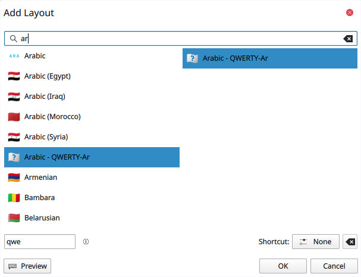

# Linux Installation Guide  QWERTY-Ar Keyboard

This guide helps you install the QWERTY-Ar Arabic keyboard layout on Linux.

1- Run the provided **script**:

```bash
chmod +x install.sh
./install.sh
```
The script:

- Copies your .xkb file to the correct system folder

- Edits evdev.xml to register your qwerty-ar layout

2- You log out and log back in, or reboot (required for desktop environments to reload the layout list)

3- Open your system's Keyboard Settings:

  - **GNOME**: Settings → Keyboard → Input Sources → Add

  - **KDE Plasma**: System Settings → Input Devices → Keyboard → Layouts → Add

  - **XFCE**: Settings → Keyboard → Layout → Add

    **Look for**:
    Name: Arabic - QWERTY-Ar
    Short Name: ar
    
    ### ScreenShot:
    

4- **Add the layout** — now you can switch between your regular layout and your custom Arabic layout from the system tray or shortcut keys
